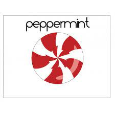

# Homework 3

## Scenario 1
* Peppermint OS
* Processor architecture- i686,x86_64
* Peppermint os is a lubuntu based linux disto that aims on being fast and easy on system rescources. Can be installed onto a live usb and used anytime. some features included are automatic updates, easy step-by-step installation, sleek and user-friendly interface, and increased mobility by integrating directly with cloud-based applications.

|Logo|Based on|URL
|-----|-----|----|
||Debian,Lubuntu (LTS)|https://distrowatch.com/table.php?distribution=peppermint|

## Scenario 2
* Linux Console 
* Processor architecture- i586,x86_64
* an independently developed linux live CD with multiple editions designed for desktops servers gaming consoles and old computer. It has an extensive choice of software installed for education and also contains parental controls.
  
|Logo|Based on|URL
|-----|-----|----|
||MATE|https://distrowatch.com/table.php?distribution=linuxconsole|

## Scenario 3
* Drauger OS
* Processor architecture- x86_64/AMD64
* an overhauled desktop designed for graphics performance and encahnced multilingual support. Was specifically made for gamers in mind. It aims to provide performance without sacrificing security. based off ubuntu lts, drauger os is stable,safe, and gets updates thanks to ubuntu repositories.

|Logo|Based on|URL
|-----|-----|----|
|| Ubuntu LTS| https://draugeros.org/go/|

## Scenario 4
* Linux Lite 
* Processor architecture- i686,x86_64
* a beginner friendly linux distro that aims to provide complete sets of applications to users including full office suite, media players, and other essential software. ALL while providing a lightweight and snappy expierence on old pc's and laptops. 

|Logo|Based on|URL|
|-----|-----|----|
||Debian, Ubuntu LTS|https://distrowatch.com/table.php?distribution=lite| 
