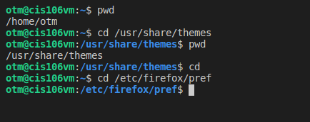
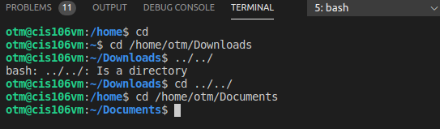
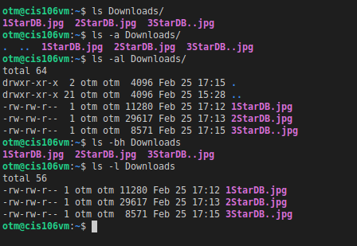
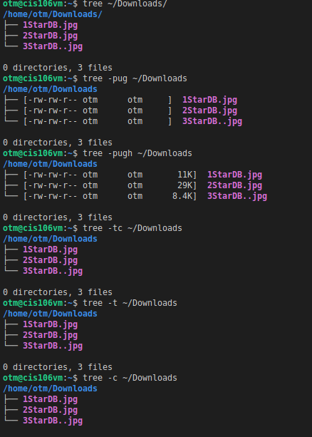
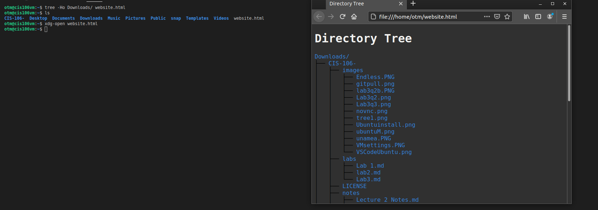
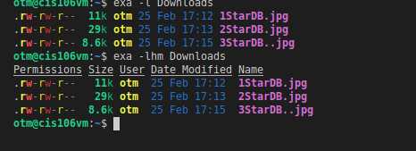

# Lab 3 | Installing software and navigating the file system | Answers
Assignment description [here](https://raw.githubusercontent.com/ra559/cis106/main/labs/lab3.md)

## Question 1
1. Which command did you use to search for the themes and to install them?
   
* apt search 'gtk theme'
* sudo apt install 'yuyo-gtk-theme'

3.1 What is the name of the package?

*  the name of the package is 'trophy'

3.2 What dependencies are needed in order to install the package?
* apport-symptoms, guile-2.2-libs, libevent-2.1-7, libfprint-2-tod1 libgc1c2, libgnome-games-support-1-3,libgnome-games-support-common, libnatpmp1, libqqwing2v5, python3-systemd
  
3.3 How much disk space will the package utilize after installation?

 * After this operation, 51.7 MB of additional disk space will be used

## Question 2
 

## Question 3

## Question 4

## Question 5
