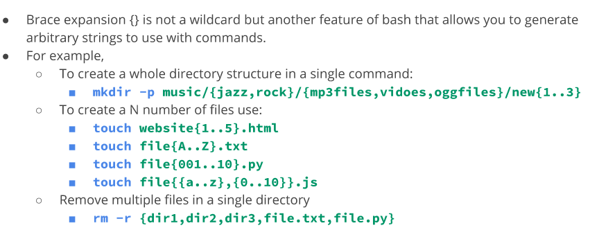

# Managing Files amd Directories 
* Getting help
* Man (Manual) Pages- Documentation files that describe the linux shell, commands, executable programs, system calls, special files and so on.
* man pages are not step by step guides, only quick references
* to view man page of command type: man + command
  * ex. man ls
* navigate man pages using arrow key or man command internal shortcuts 
* to exit  press q 
# Other ways of getting help 
* most commands have help options built in. to get help type in: -h --h or --help
* Read error messages carefully. The answer is in the error itself most of the time 
* apropos command helps see the man page name and description of a certain command 
* whatis command displays a simple description of what a command does 
* cheat program is also available to DL  and help view commands. To install: sudo apt install cheat 
* GOOGLE IT 
# Wild Cards 
* Wildcards represent letters and characters used to specify a file name for searches 
* file globbing is the proccessing of pattern matching using wildcards 
* officially called metacharacter wildcards 
##  The * wildcard the star alone matches anything and nothing and matches any number of characters 
  * ex: ls *.txt will match any and all files ending in .txt regardless of size or name
## The ? Wildcard matches precisely one character. Might need the ? to minimize a long list of file names down to a few 
* proves useful when working with hidden files (also called . files)
* NOT THE SAME as using the * wildcard on its own 
* problem with dot files and wildcards is the current directory and the parent directory have a name 
* current directory is called ./ and the parent directory has two dots ../ 
* to go around this, use ./.* to match all files in current directory with file name starting with a dot 
* can also match all files in directory using ../.*
## The [] Wildcard - brackets match a single character in a range 
* [] wildcard uses the exclamation mark to reverse the match.
  ## Wildcards/ Globbing quick references 
   
  # Shell Expansion 
  * **Brace Expansion** {} is not a wildcard but another feature of bash that allows you to generate arbitrary strings to use with commands 

  
